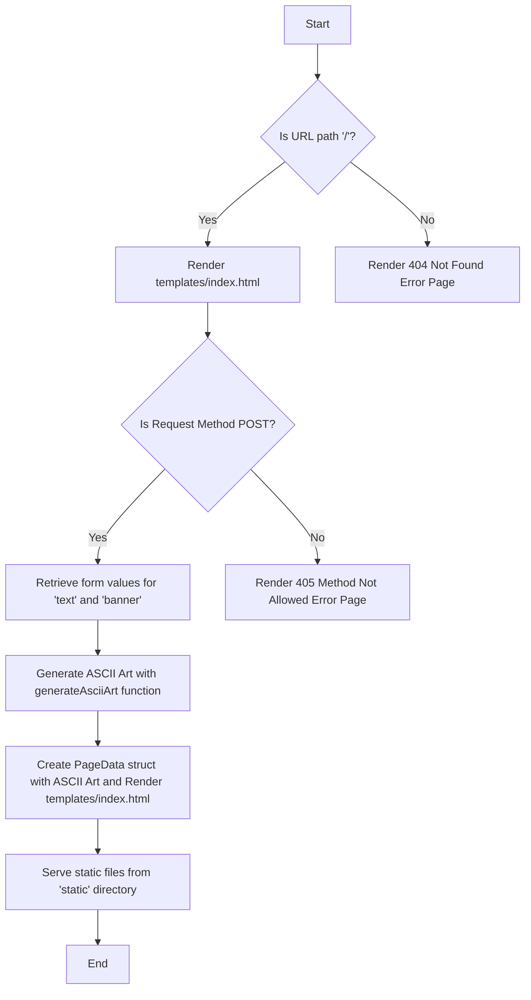

# Ascii-Art-Web 👋

## Objectives

The Ascii-Art-Web is a robust web application designed to create ASCII Art from user input text through an intuitive web GUI. Users can input any ASCII character and create various banners such as 'shadow', 'standard', and 'thinkertoy'. The generated ASCII Art can be viewed directly on the webpage, providing a unique and visually pleasing experience for the users.

## Implementation

The Ascii-Art-Web application follows a sequential algorithm to serve ASCII art banners to users through a web interface. Below are the steps involved in the algorithm and the flowchart:



1. **Initialize the Server:**

   - Initialize an HTTP server listening on port 8080.

1. **Setup Static File Serving:**

   - Define the `/static/` route to serve static files (CSS, JS, images, etc.) from the "static" directory.

1. **Define Request Handlers:**

   - Define the request handler functions that will process incoming HTTP requests.
   - `handleDefault`: Manages the default route ("/").
   - `handleAsciiArt`: Manages the "/ascii-art" route.

1. **Process HTTP Requests:**

   - `handleDefault` function:
     - Check if the URL path is exactly "/".
     - If not, render a 404 Not Found error page.
     - If yes, render the "templates/index.html" template.
   - `handleAsciiArt` function:
     - Only allow POST requests.
     - If the request method is not POST, render a 405 Method Not Allowed error page.
     - Retrieve form values for "text" and "banner" from the request.
     - Call `generateAsciiArt` function to create ASCII art.

1. **Generate ASCII Art:**

   - `generateAsciiArt` function:
     - Split the text into words.
     - Read the contents of the file named "templates/{banner}.txt".
     - Split the contents into lines.
     - For each character in each word, look up the corresponding lines from the banner file.
     - Concatenate the lines to create ASCII art.

1. **Render Templates:**

   - `renderTemplate` function:
     - Parse the specified template file.
     - If there is an error, render a 404 Not Found error page.
     - Execute the template with the provided data.
     - If there is an error, render a 500 Internal Server Error page.

1. **Render Error Pages:**

   - `renderErrorPage` function:
     - Set the response status code.
     - Parse the error page template.
     - Execute the template with the status code.

1. **Start Server:**
   - In the main function, set up static file serving and define route handlers.
   - Start the server and print a message indicating that the server is listening.

This algorithm ensures that the web application is capable of handling requests, generating ASCII art, and rendering the appropriate responses or error pages.

## Usage

To utilise Ascii-Art-Web, follow the below instructions:

1. Run the program:

   ```bash
   $ go run main.go
   server started. Listening on http://localhost:8080
   ```

1. Access the server by opening [localhost:8080](http://localhost:8080/) in your web browser.

1. Input any English text into the "Type in words to generate ascii-art" field.

1. Select your preferred banner style from the available options.

1. Click the "Generate Ascii Art" button and observe your text transformed into beautiful ASCII Art!

### Authors

- George Saad
- Jordan Smith
- Mikal Laane
